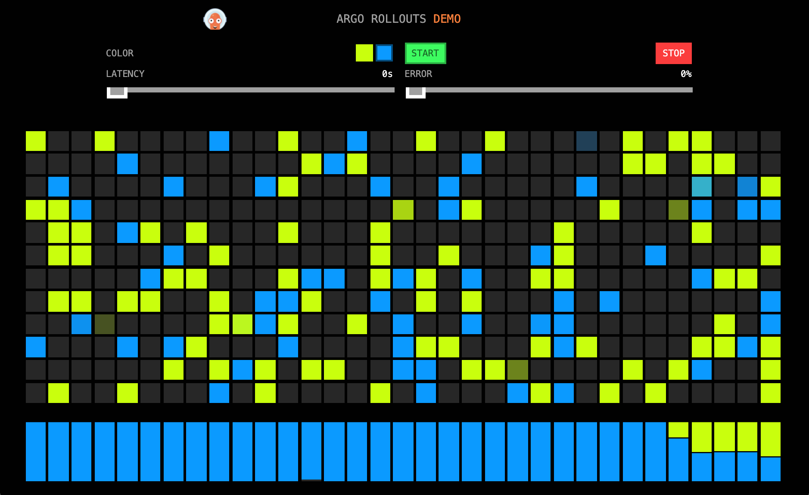

# Open Telemetry Demo Application

This repo contains the [Argo Rollouts](https://github.com/argoproj/argo-rollouts) demo application instrumented with 
[Open Telemetry](https://opentelemetry.io/).



## Datadog Integration

The Helm chart supports [Datadog Unified Service Tagging](https://docs.datadoghq.com/getting_started/tagging/unified_service_tagging/) via APM. When enabled, the chart injects `DD_ENV`, `DD_SERVICE`, and `DD_VERSION` environment variables into the pod (sourced from pod labels), and mounts the Datadog Agent APM socket.

Enable it in your values:

```yaml
datadog:
  enabled: true
  env: prod
```

The following tags are applied to all traces and metrics:

| Tag | Value |
|-----|-------|
| `env` | `.Values.datadog.env` |
| `service` | chart name (`otel-app`) |
| `version` | image tag, falling back to chart version |

### APM Queries

Filter traces in the Datadog APM explorer using unified service tags:

```
env:prod service:otel-app version:0.5.0
```

**HTTP error rate** (Datadog Metrics):

```
sum:trace.http.request.errors{env:prod,service:otel-app} / sum:trace.http.request.hits{env:prod,service:otel-app}
```

**Error rate by version** (useful during rollouts):

```
sum:trace.http.request.errors{env:prod,service:otel-app} by {version} / sum:trace.http.request.hits{env:prod,service:otel-app} by {version}
```

**P99 latency by version:**

```
p99:trace.http.request{env:prod,service:otel-app} by {version}
```

### Argo Rollouts AnalysisTemplate

The following `AnalysisTemplate` uses the Datadog provider to measure HTTP error rate during a rollout. It fails the analysis if any errors are detected across 4 consecutive 15s intervals.

```yaml
apiVersion: argoproj.io/v1alpha1
kind: AnalysisTemplate
metadata:
  name: apm-error-rate
spec:
  args:
  - name: service
  - name: env
  - name: version
  metrics:
  - name: error-rate
    interval: 15s
    count: 4
    failureCondition: default(result, 0) > 0
    failureLimit: 0
    provider:
      datadog:
        apiVersion: v2
        interval: 1m
        queries:
          errors: sum:trace.http.request.errors{env:{{args.env}},service:{{args.service}},version:{{args.version}}}.as_rate()
          hits: sum:trace.http.request.hits{env:{{args.env}},service:{{args.service}},version:{{args.version}}}.as_rate()
        formula: errors / hits
```

## Prometheus Integration

### ServiceMonitor

The Helm chart includes an optional [Prometheus Operator](https://github.com/prometheus-operator/prometheus-operator) `ServiceMonitor` to scrape metrics from the `:8080/metrics` endpoint.

Enable it in your values:

```yaml
serviceMonitor:
  enabled: true
  interval: 30s
  # Add labels required by your Prometheus operator's serviceMonitorSelector (if any)
  labels: {}
    # release: prometheus
```

The ServiceMonitor propagates the `app.kubernetes.io/version` pod label onto scraped metrics via `podTargetLabels`, allowing queries to be broken down by application version.

> **Note:** Ensure the Prometheus ServiceAccount has RBAC permission to read `services`, `endpoints`, and `pods` in the namespace where the app is deployed.

### HTTP Error Rate Query

To detect HTTP 5xx error rate broken down by application version:

```promql
sum by (app_kubernetes_io_version) (rate(http_requests_total{service="otel-app", code=~"5.."}[5m]))
/
sum by (app_kubernetes_io_version) (rate(http_requests_total{service="otel-app"}[5m]))
```

### Argo Rollouts AnalysisTemplate

The following `AnalysisTemplate` uses the Prometheus provider to measure HTTP error rate during a rollout. It fails the analysis if the error rate exceeds 1% across 4 consecutive 15s intervals.

```yaml
apiVersion: argoproj.io/v1alpha1
kind: AnalysisTemplate
metadata:
  name: http-error-rate
spec:
  args:
  - name: service
  - name: version
  metrics:
  - name: error-rate
    interval: 15s
    count: 4
    failureCondition: default(result, 0) > 0.01
    failureLimit: 0
    provider:
      prometheus:
        address: http://prometheus-k8s.monitoring.svc.cluster.local:9090
        query: |
          sum(rate(http_requests_total{service="{{args.service}}", app_kubernetes_io_version="{{args.version}}", code=~"5.."}[1m]))
          /
          sum(rate(http_requests_total{service="{{args.service}}", app_kubernetes_io_version="{{args.version}}"}[1m]))
```
